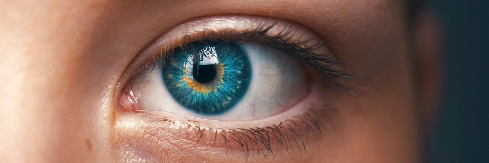
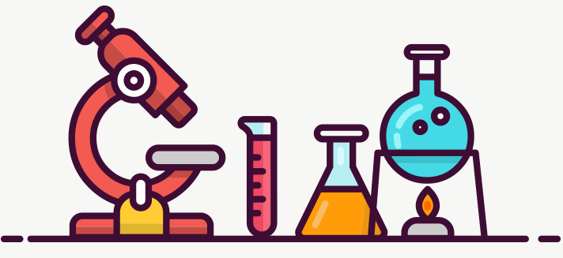

# 

&nbsp;&nbsp;
&nbsp;&nbsp;

### Hi there 👋

 

  

Intro... blablablablablablablablablablablablablablablablablablablablablablablablablablablablablablablablablablablablablablablablablablablablablablablablablablablablablablablablablablablablablablablablablablablablablablablablablablablablablablablablablablablablablablablablablablablablablablablablablablablablablablablablablablablablablablablablablablablablablablablablablablablablablablablablablablablablablablablablablablablablablablablablablablablablablablablablablablablablablablablablablablablablablablablablablablablablablablablablablablablablablablablablablablablablablablablabla

 ---
 
 

  

 
### Medium articles

x 
y 
z 
a 

 ---
 
 

  

 
### Scientific papers

x 
y 
z 
a 
b 
c

 ---

<!--
**aissam-out/aissam-out** is a ✨ _special_ ✨ repository because its `README.md` (this file) appears on your GitHub profile.

Here are some ideas to get you started:

- 🔭 I’m currently working on ...
- 🌱 I’m currently learning ...
- 👯 I’m looking to collaborate on ...
- 🤔 I’m looking for help with ...
- 💬 Ask me about ...
- 📫 How to reach me: ...
- 😄 Pronouns: ...
- ⚡ Fun fact: ...
-->
