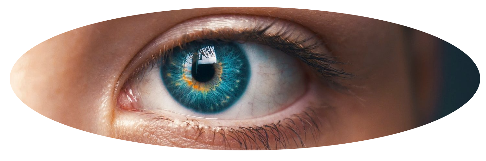
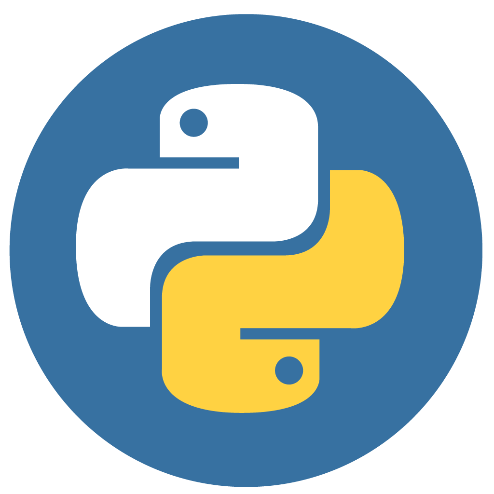

<!--# -->

</a>&nbsp;&nbsp;
&nbsp;&nbsp;
&nbsp;&nbsp;
&nbsp;&nbsp;
</a>

### Hi there 👋

 

  

I'm Aissam : Researcher, programmer and passionate about Machine/Deep Learning, currently working as Head of R&D lab at MonarkIT, Marrakech.

I'm very interested in developping applications (skills/actions) for voice assistants, namely Amazon's Alexa and Google Assistant.

I use Python, Python and Python ..

You can find me on twitter : [@aissam_out](https://twitter.com/aissam_out) 

 ---
 
 ### Technologies and tools

 ---

<b>Medium articles</b>

 

  

[A guide to building WhatsApp chatbots using Dialogflow and FireBase](https://towardsdatascience.com/a-guide-to-building-whatsapp-chatbots-using-dialogflow-and-firebase-4ff5e904ac3) 
> A step-by-step tutorial to create smart chatbots for your business and have them to interact with your backend  

[Machine Learning in production: Keras, Flask, Docker and Heroku](https://towardsdatascience.com/machine-learning-in-production-keras-flask-docker-and-heroku-933b5f885459) 
> Pipeline for ML/DL solutions: Build the model, create an API to interact with it, containerize it and deploy it  

[Emergence as the starting point to Artificial General Intelligence](https://aissam-outchakoucht.medium.com/emergence-as-the-starting-point-to-artificial-general-intelligence-a789ecce388b) 
> What made humans unique and therefore let them triumph over this planet, is their ability to add flexibility to the common ingredients of emergence: number and cooperation

 ---

<b>GitHub Statistics</b>

<!--
**aissam-out/aissam-out** is a ✨ _special_ ✨ repository because its `README.md` (this file) appears on your GitHub profile.

Here are some ideas to get you started:

- 🔭 I’m currently working on ...
- 🌱 I’m currently learning ...
- 👯 I’m looking to collaborate on ...
- 🤔 I’m looking for help with ...
- 💬 Ask me about ...
- 📫 How to reach me: ...
- 😄 Pronouns: ...
- ⚡ Fun fact: ...
-->
